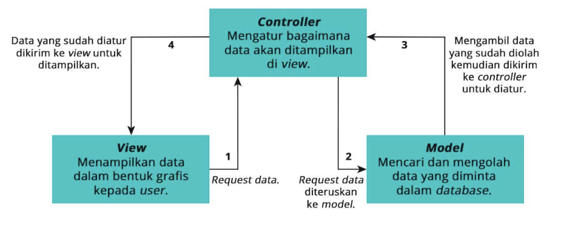

| Nama | NRP |
| --- |---|
| Nabilah Atika Rahma | 5025221005 |
| Week 1 PBKK |

`Chapter 1. Introduction to courses`

- Refresher OOP & PHP  
https://github.com/dptsi/laravel-tutorial 
Create a Class for Mobile Phones: Design a class that represents a mobile phone. The class should have attributes like name, brand, price, and stock quantity. 
Main Operations: Create a main class that handles the inventory of mobile phones. This class should have methods for adding, deleting, and updating phone data. 
Apply Basic OOP Concepts: Use basic OOP concepts like Abstraction, Encapsulation, and Inheritance in your design. 
Implement Polymorphism: Apply the concept of Polymorphism in your classes.  
- What is frameworks?  
https://aws.amazon.com/what-is/framework/
https://www.codecademy.com/resources/blog/what-is-a-framework/  
- MVC  

MVC: https://www.dicoding.com/blog/apa-itu-mvc-pahami-konsepnya/

