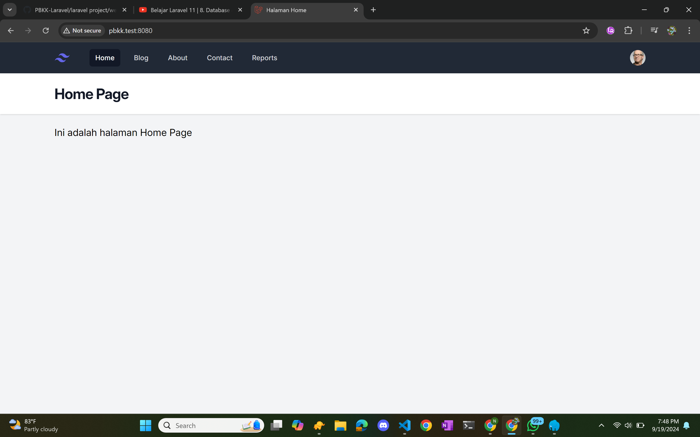
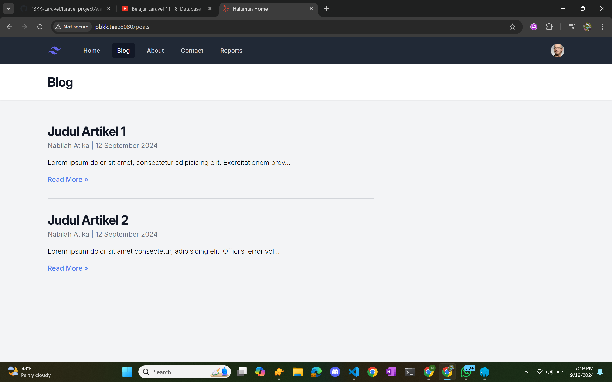
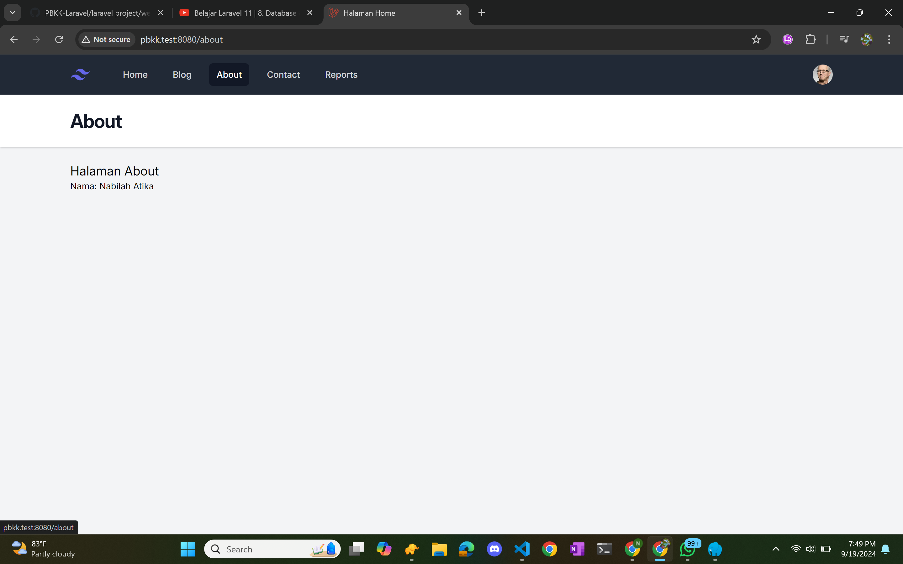
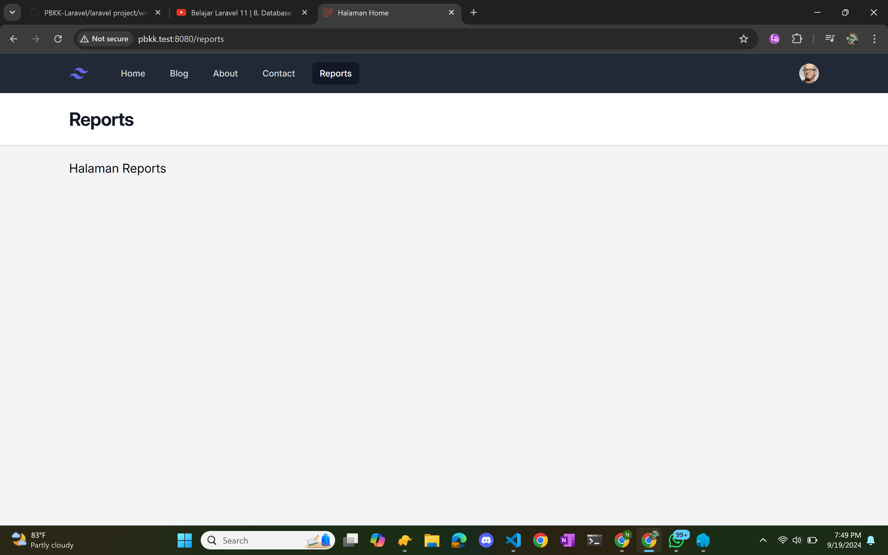
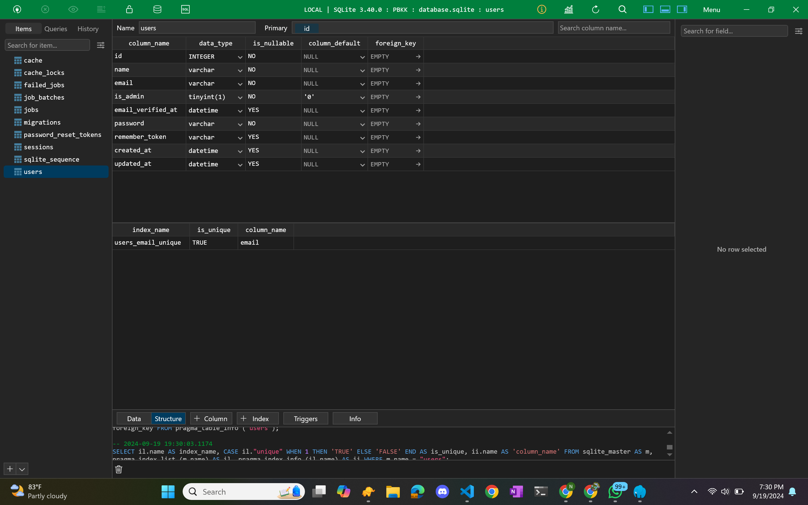
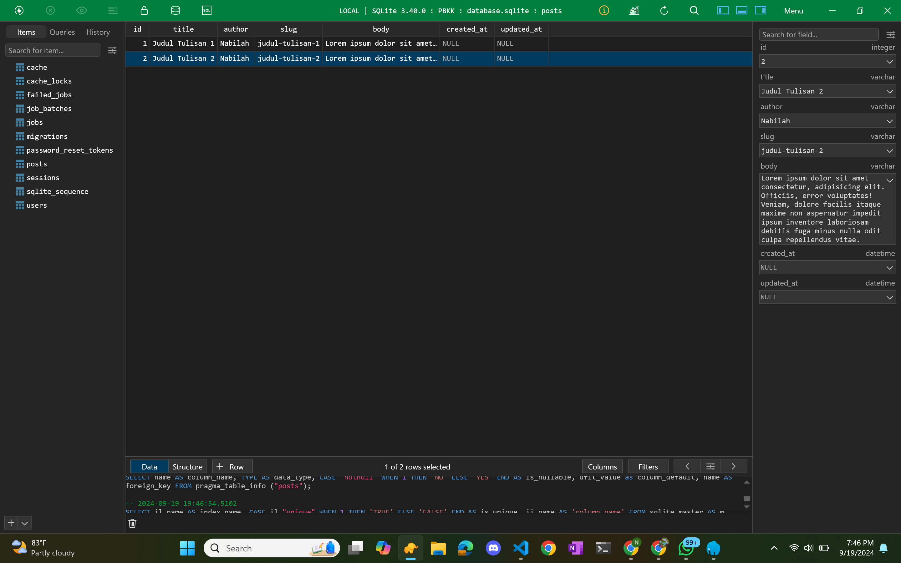

| Nama | NRP |
| --- |---|
| Nabilah Atika Rahma | 5025221005 |
| Week 3 PBKK |

`Chapter 2`

- View Data
- Model

- Screenshoot 
    
    
    
    
    
    
    

- Explain UI

    1. Main Navigation Bar  
        - Position: The navigation bar is located at the top of every page, with a dark background (dark theme). 
        - Navigation Elements: The navigation bar contains several links that direct the user to different sections of the website: 
        - Home: The main homepage. 
        - Blog: A page for blog posts. 
        - About: An "About" page with information. 
        - Contact: A contact page. 
        - Reports: A page for reports. 
        - Profile Icon: On the right-hand side, there is a user avatar icon, likely indicating a place for profile access or user login functionality. 
    2. Displayed Pages
    Each page has a clean and simple layout, primarily focusing on textual content with a white background.

        - Home Page  
            Title: "Home Page". 
            Content: A simple message in Indonesian, "Ini adalah Halaman Home Page", which translates to "This is the Home Page." 
            Active Navigation: The "Home" menu item in the navigation bar is highlighted, indicating it is the current page. 
        - Blog Page  
            Title: "Blog". 
            Content: A brief welcome message, "Welcome to my Blog!" 
            Active Navigation: The "Blog" menu item is highlighted, showing that this is the current page. 
        c. About Page 
            Title: "About". 
            Content: The page displays "Halaman About" (translated: "About Page"), and below that is a placeholder for user information, showing "Nama: [User Name]", where "[User Name]" would be replaced by the actual name of the user. 
            Active Navigation: The "About" link in the navigation is highlighted. 
        - Contact Page 
            Title: "Contact". 
            Content: The page only contains simple text: "Halaman Contact", meaning "Contact Page" in Indonesian. 
            Active Navigation: The "Contact" menu is active in the navigation. 
        - Reports Page 
            Title: "Reports". 
            Content: Displays the text "Halaman Reports", which means "Reports Page". 
            Active Navigation: The "Reports" link is highlighted in the navigation bar. 

    3. Design and Layout 
        - Minimalist Layout: Each page features a simple design with a white background and black text. The content is displayed in large blocks with ample spacing, creating a clean and readable layout. 
        - Color Theme: The site uses a contrast between the white content background and a dark background for the navigation bar. 
        - Responsive Design: The design appears to be simple and likely responsive, as there are no complex elements like large images or intricate visual effects. 
    4. Possible Purpose 
        - Demo or Practice Site: The website seems to be used as a demonstration or a practice project for creating basic website structures. It shows multiple pages with a consistent layout and simple navigation. 
        - Placeholder Content: The text on each page seems to be placeholder content, meaning that it's likely to be replaced later with real information. 

