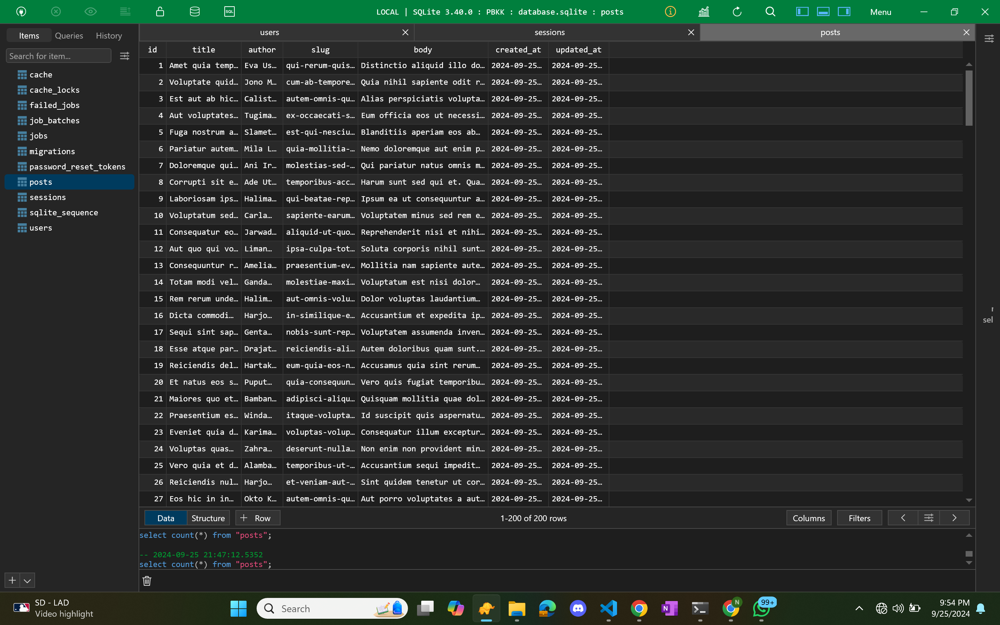
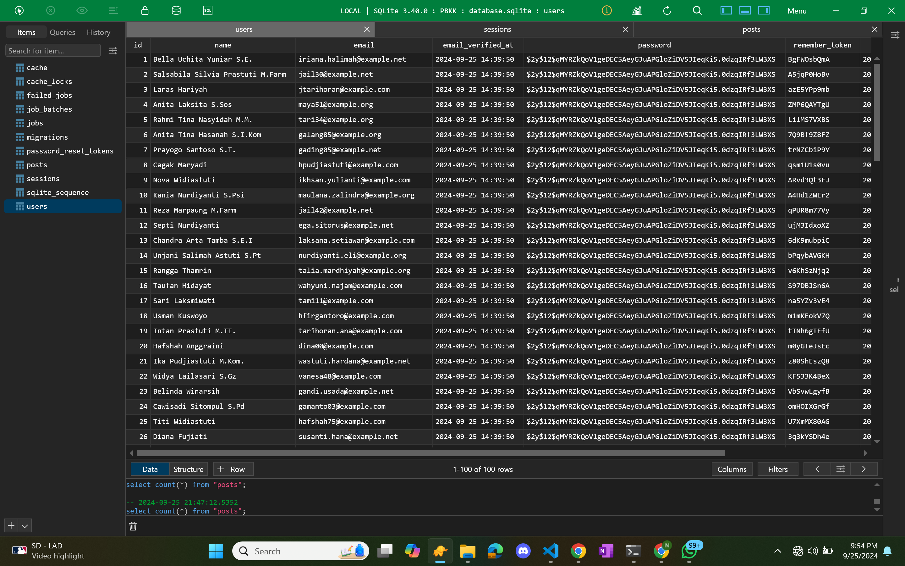
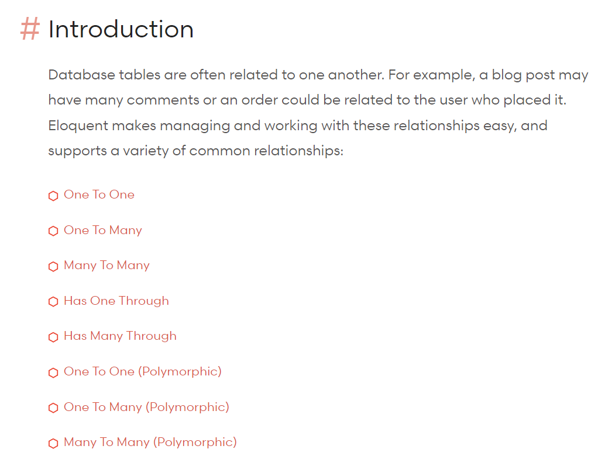
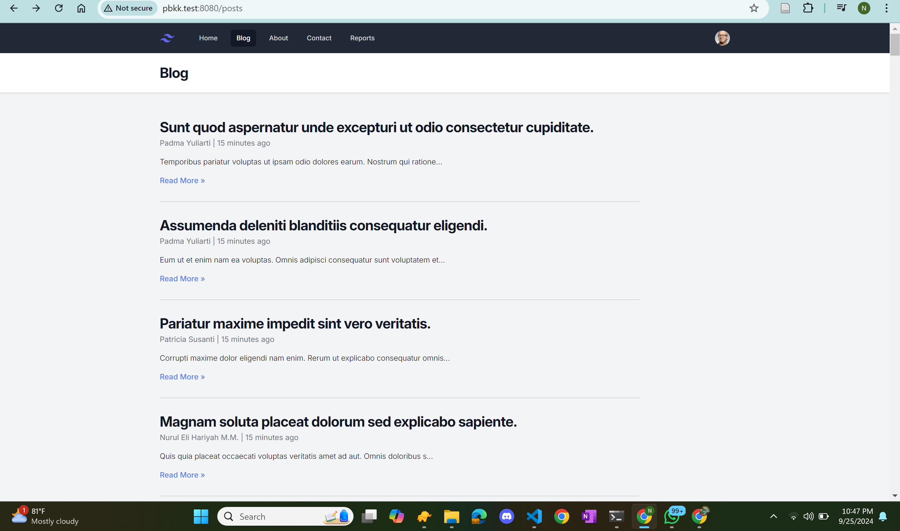
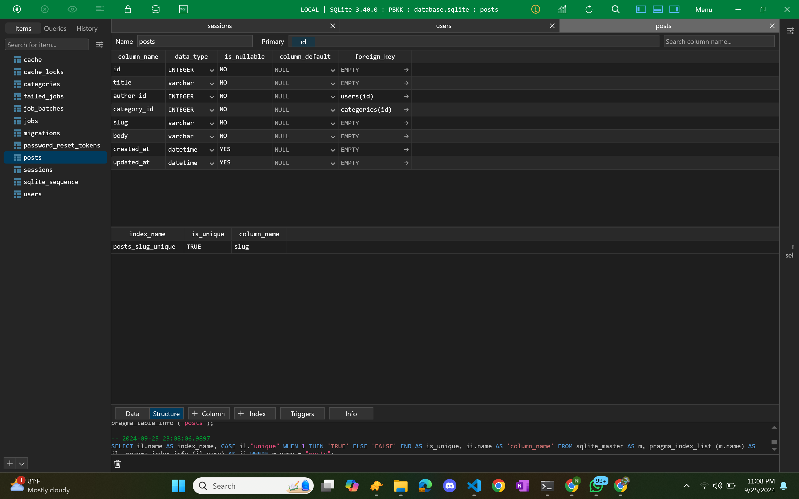
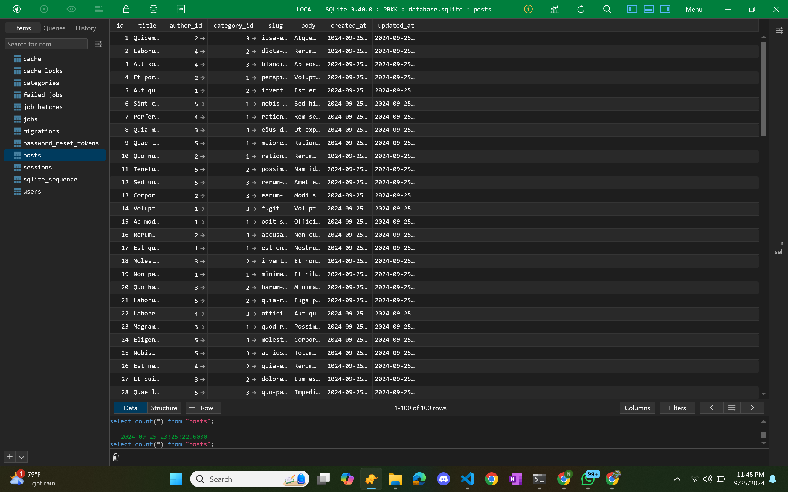
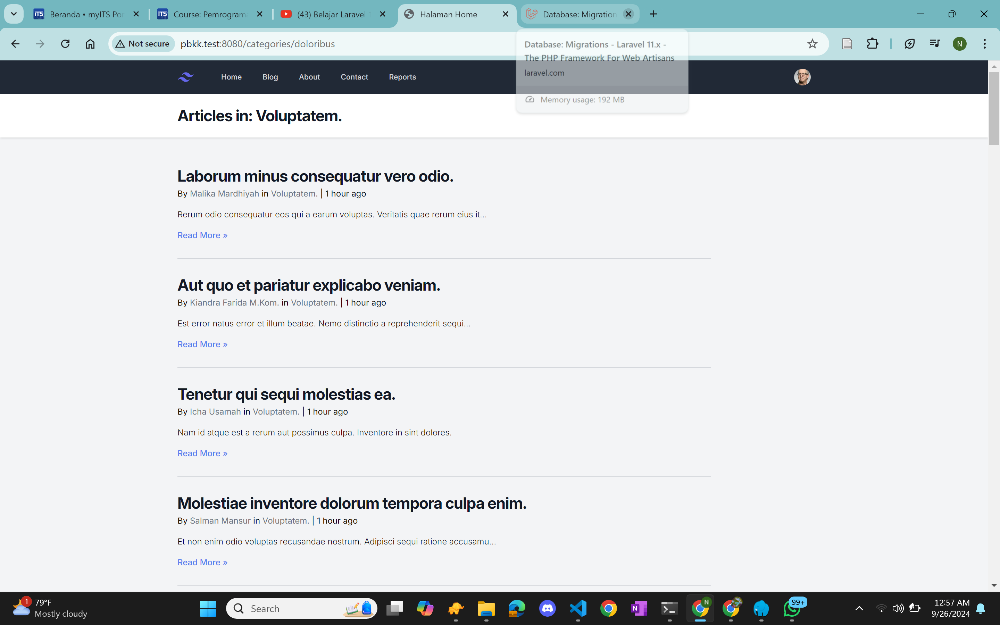
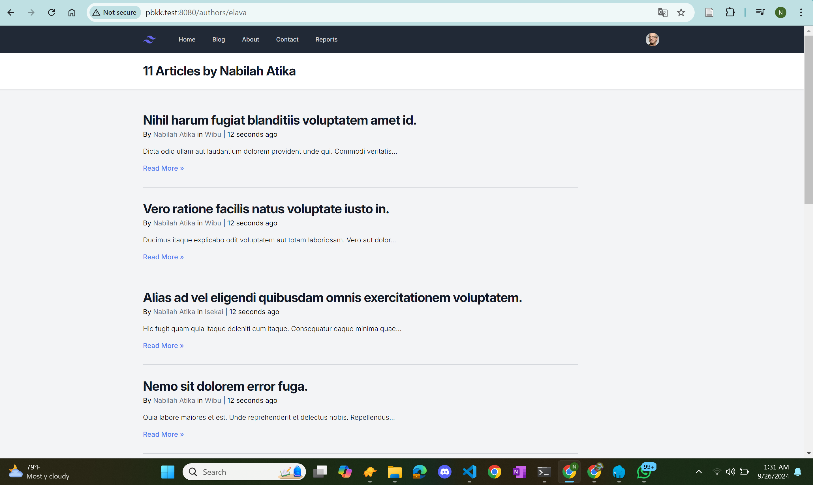
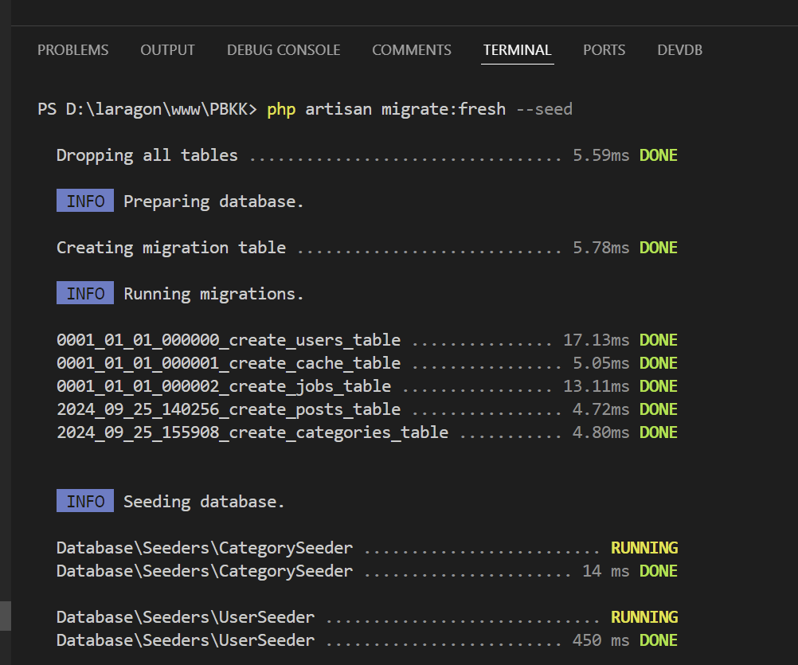

| Nama | NRP |
| --- |---|
| Nabilah Atika Rahma | 5025221005 |
| Week 5 PBKK | PBKK D |

`Chapter 5`

- Model Factories 
- Eloquent Relationship   
- Database Seeder 

`LARAVEL PROJRCT`

- In Week 5 We Learn About  

    `10.`  
    
    Pembahasan tentang model factories di Laravel 11 yang mempermudah pembuatan data dummy secara otomatis. Dengan menggunakan factories, pengguna dapat menghasilkan banyak data sekaligus tanpa harus memasukkan data secara manual. Video ini juga menjelaskan cara menggunakan faker untuk menghasilkan data yang lebih realistis dan cara membuat factory sendiri untuk model yang berbeda.

         
        
    
     

    `11.`  
    
    Pembahasan terkait Eloquent Relationship di Laravel 11, menghubungkan tabel user dan post. Penulis post akan terhubung dengan user terdaftar melalui Foreign Key. Diperlihatkan cara mendefinisikan relasi one to many, serta implementasi di model dan migrasi. Tugas diberikan untuk membuat kategori post dengan relasi serupa. 

            

    Eloquent Relationship adalah fitur dalam Laravel yang memungkinkan pengembang untuk mendefinisikan dan mengelola hubungan antar model database dengan cara yang sederhana dan intuitif. Dengan Eloquent dapat dengan mudah menyusun, mengambil, dan memanipulasi data yang terhubung di tabel-tabel yang berbeda menggunakan metode yang sudah disediakan. 

            

    `12.`  

    Pembahasan terkait Laravel 11 yang menjelaskan cara menambahkan kategori pada model Post. Setelah memperbaiki tampilan user dengan username, kategori baru dibuat melalui model, migrasi, dan factory. Kategori dihubungkan dengan Post menggunakan relasi Eloquent. Akhirnya, tampilan kategori dan rute baru diimplementasikan untuk menampilkan artikel berdasarkan kategori.

            
     
           
     

    `13.`  

    Pembahasan tentang fitur database seeder di Laravel 11, yang memudahkan pengisian data dummy secara otomatis ke dalam database. Dengan seeder, pengguna dapat melakukan migrasi dan pengisian data dalam satu langkah, serta menggabungkannya dengan factory untuk efisiensi yang lebih baik.  

     
           

    Database seeder dalam Laravel adalah fitur yang memungkinkan pengembang untuk dengan mudah mengisi database dengan data dummy atau data awal saat pengembangan aplikasi. Seeder adalah skrip yang dibuat untuk menjalankan perintah insert ke dalam tabel-tabel database. Dengan seeder, kita bisa:

    1. Mengisi data secara otomatis:  Seeder mengotomatisasi proses pengisian data, sehingga Anda tidak perlu mengisi data secara manual.
    
    2. Membuat data uji:  Create data dummy yang bisa digunakan untuk pengujian aplikasi.

    3. Combine with Factory:   Seeder dapat digabungkan dengan Factory untuk menghasilkan data acak atau beragam tanpa perlu menulis data secara manual.
    (Kalau Factory kan manual ditulis dalam tinker, nah seeder lebih mudah digunakan dan otomatis simple)

    4. Mempercepat pengembangan:  Dengan adanya data dummy, bisa lebih cepat dalam melakukan pengujian dan pengembangan fitur.  
    
    

    Untuk menggunakan database seeder, Anda biasanya akan membuat kelas seeder menggunakan perintah Artisan dan mendefinisikan data yang ingin dimasukkan ke dalam database di dalam metode run() di kelas tersebut. Setelah itu, Anda dapat menjalankan seeder dengan perintah Artisan untuk populasi data ke dalam database.

    

