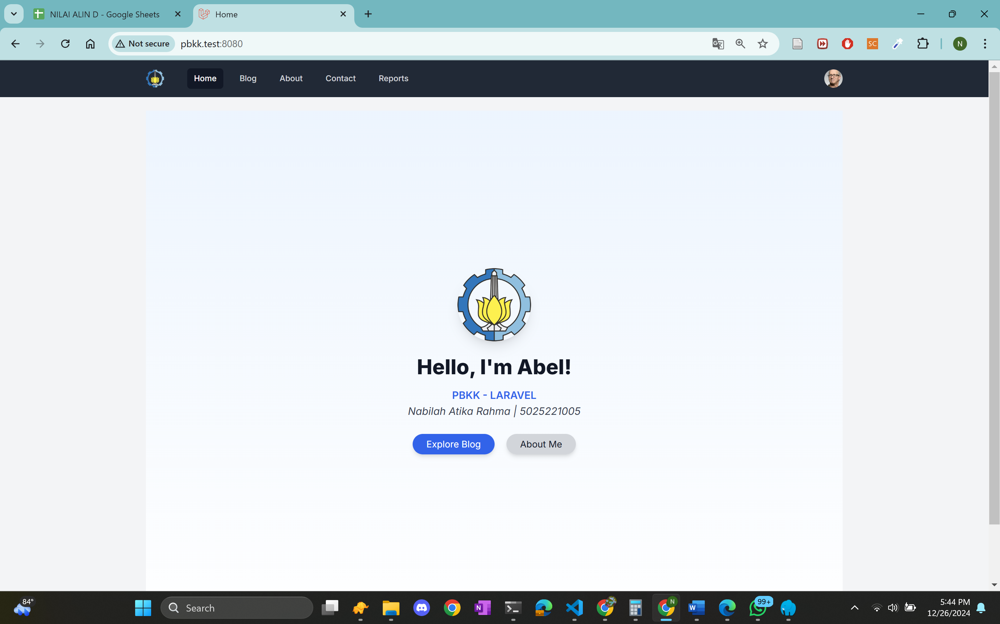
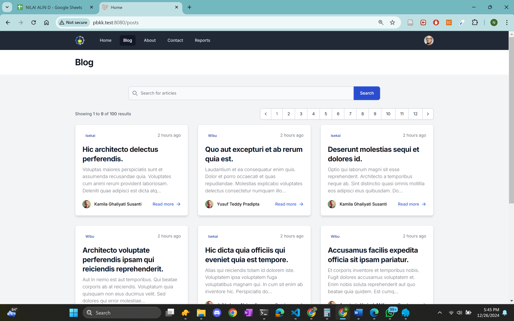
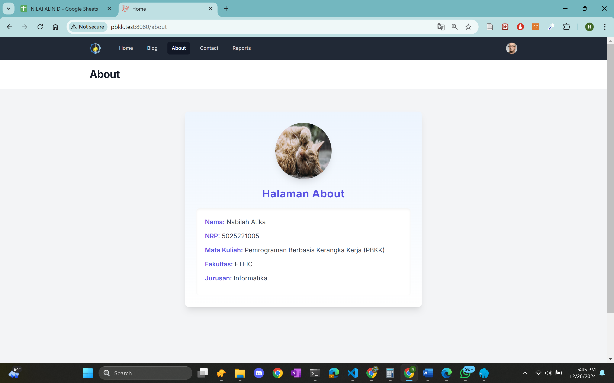
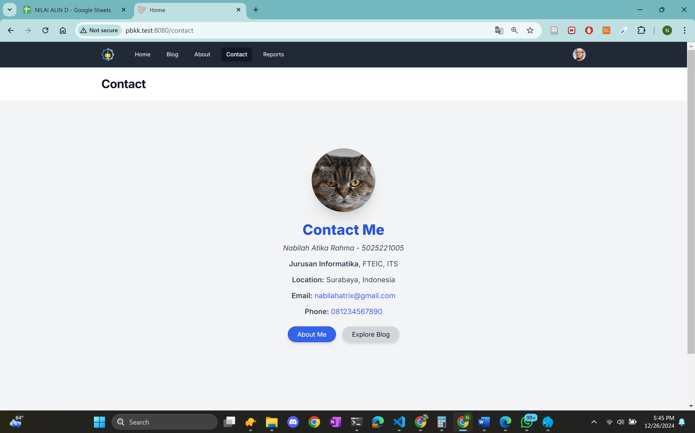
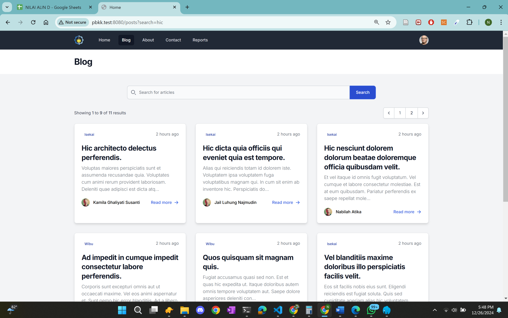
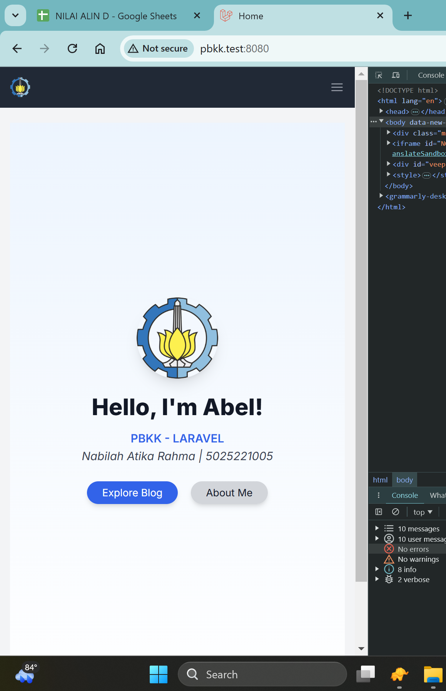
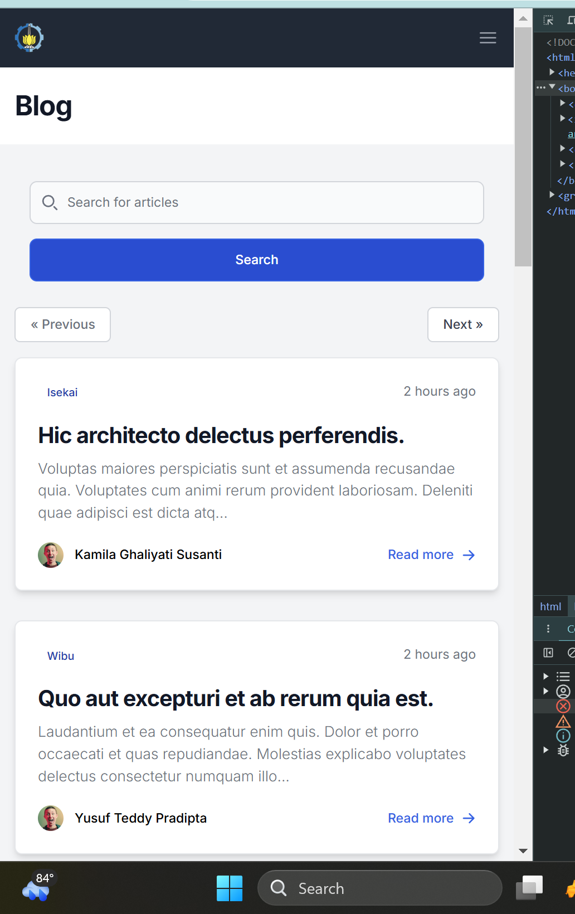
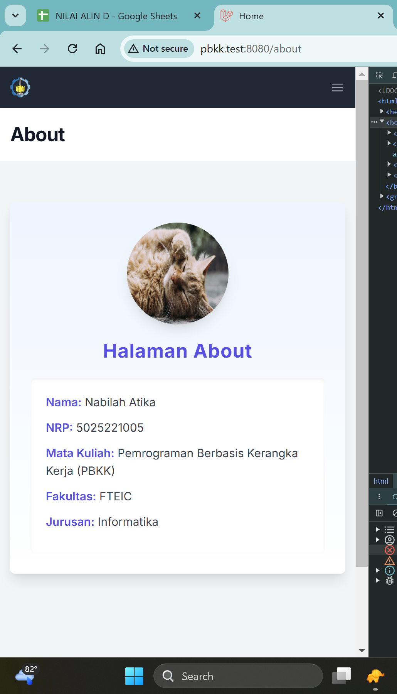
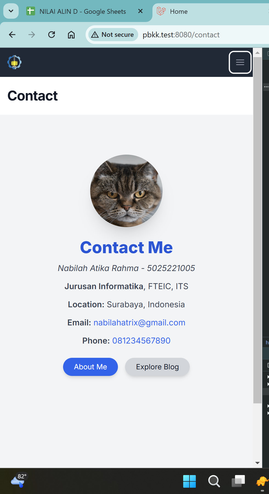
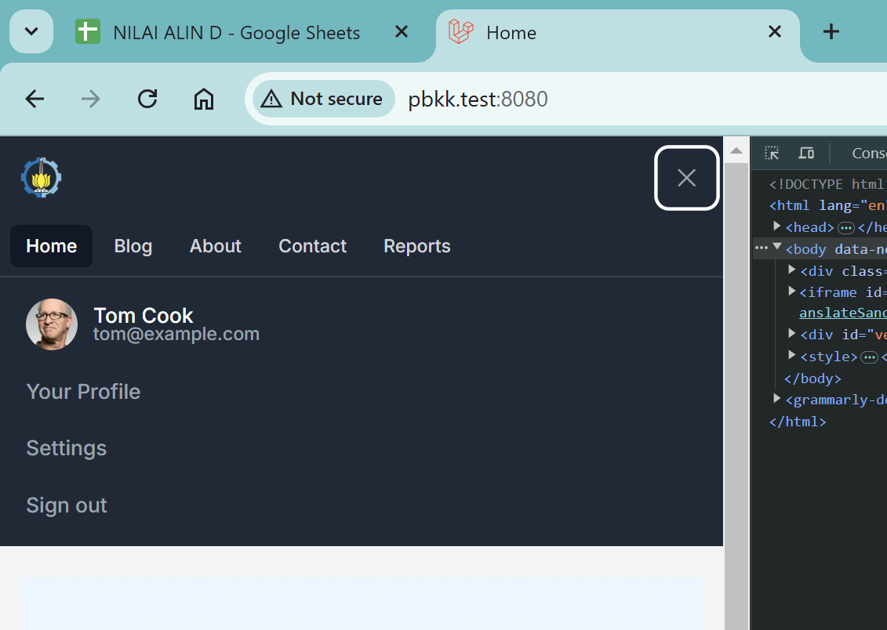

| Nama | NRP |
| --- |---|
| Nabilah Atika Rahma | 5025221005 |
| Week 5 PBKK | PBKK D |

`Chapter 5`

- [N + 1 Problem](https://youtu.be/K2p6Mtz5P20)  
- [Redesign UI](https://youtu.be/uVRN9DzUAU8)   
- [Searching](https://youtu.be/8hhaAsRFAJs)    
- [Pagination](https://youtu.be/HP3CdxX9oak)

`LARAVEL PROJRCT`

- In Week 6 We Learn About  

    `14.`  
    
    N + 1 problem adalah isu yang muncul saat melakukan query berulang dalam relasi database, seperti antara tabel Post dan User. Dengan menggunakan Eager loading, kita dapat mengoptimalkan query dan mengurangi jumlahnya, sehingga aplikasi menjadi lebih cepat. Solusi ini penting untuk meningkatkan performa aplikasi Laravel

    `15.`  
    
    Redesign UI antarmuka pengguna blog menggunakan komponen kartu dan Flowbite untuk membuat tata letak yang lebih menarik. Tuan rumah memulai transisi dari format daftar ke format kartu menggunakan Tailwind CSS dan komponen Flowbite. Instalasi dan integrasi Flowbite ke dalam proyek Laravel dirinci, termasuk penyesuaian konfigurasi yang diperlukan. 

    `16.`  

    Add fitur searching / pencarian ke aplikasi blog berbasis Laravel, termasuk menyiapkan komponen pencarian menggunakan Flowbite, menangkap data pencarian dengan metode permintaan Laravel, dan menggunakan cakupan kueri untuk manajemen pencarian yang efisien, meningkatkan fungsionalitas pencarian dengan memperkenalkan filter untuk pencarian berbasis kategori dan penulis, menyesuaikan logika perutean, dan menguji implementasinya. 

    `17.`  

    Berfokus pada penerapan pagination dalam aplikasi Laravel 11, pentingnya pagination untuk mengelola kumpulan data yang besar secara efisien dan penggunaan Tailwind CSS untuk pagination. Opsi kustomisasi tingkat lanjut juga dibahas, termasuk menggunakan kerangka kerja CSS yang berbeda dan menerbitkan file vendor untuk diedit.

## Screenshoot

terlihat jelas mengenai update web mengikuti tutorial dari awal hingga akhir dan juga responsif.

     
     
     
     
     

    
    
    
    
    

